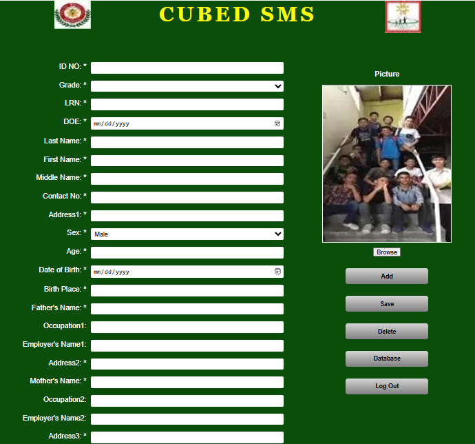

# 🎓 CUBED Student Management System (SMS) - Registration Interface

# 📝 Project Overview
* This project is a web-based interface for a **Student Management System** designed to digitize the student registration process.
* It provides a structured and user-friendly electronic form to collect and manage academic and personal records.
* The project was developed as a practical application for the **Web Technologies** course in Al-Azhar University-Gaza.

# 📸 Project Preview

# 🚀 Key Features
* **📋 Comprehensive Data Entry**: Includes over 20 fields for capturing student information, such as academic IDs (LRN), personal details, and parental information.
* **🖱️ Interactive UI Elements**: 
    * **📅 HTML5 Input Types**: Integration of date pickers for Date of Enrollment and Birth Date.
    * **🔽 Dropdown Menus**: Use of selection tags for Grade and Sex selection.
* **🖼️ Media Management**: A dedicated section for student profile pictures with "Browse" functionality.
* **⚙️ System Operation Buttons**: Structured action buttons for administrative tasks: **Add**, **Save**, **Delete**, **Database access**, and **Log Out**.

# 🛠️ Technologies Used
* **🌐 HTML5**: Used for creating the semantic structure and layout of the registration form.
* **🎨 CSS3**: Implemented via an external stylesheet (`Style.css`) to handle the visual presentation, including the dark-green theme and yellow typography.
* **✍️ Development Tool**: Developed and structured using **Notepad++**.

# 📂 Project Structure
* **📄 index.html**: The core HTML document containing the document structure and form elements.
* **🎨 Style.css**: The external CSS file used to manage colors, positioning, and overall aesthetic.
* **📁 Interface/**: A dedicated folder created to store all UI assets and images for better organization [2].
    * **🖼️ Project-preview.png**: The image file showing the final design for the README.
    * **🖼️ Logos & Assets**: All icons and logos used in the header and form.

# 📖 How to View
* ⬇️ Clone or download the repository.
* 📁 **Important Step**: Create a folder named **Interface** in the main directory.
* 🖼️ **Image Setup**: Place all the required logos and photos (like Group photo.png, Left logo.png, Right photo.png) inside the **Interface** folder to ensure they load correctly.
* 📁 Ensure **index.html**, **Style.css**, and the **Interface** folder are in the same directory.
